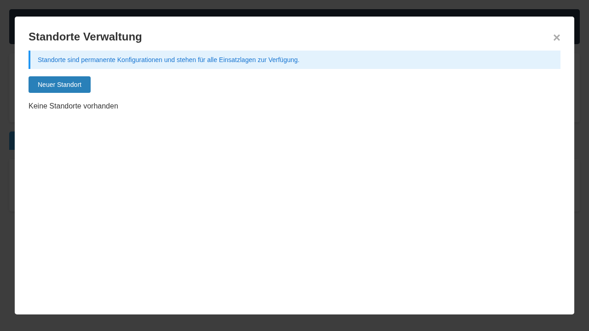
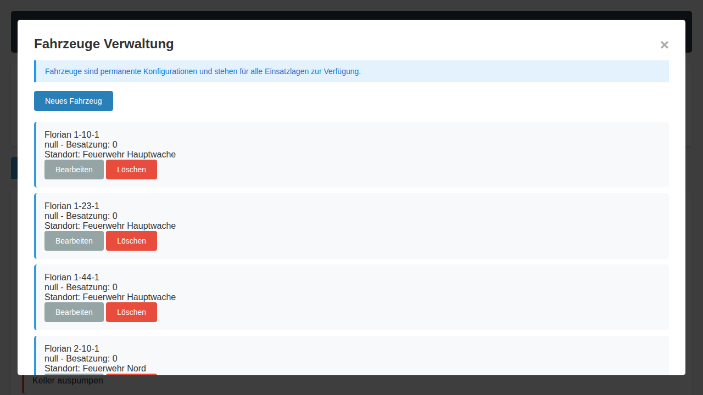

# Admin-Guide (TEL-System)

## Zweck
Dieser Guide richtet sich an technische und organisatorische Administratoren des TEL-Systems.

## 1. System bereitstellen

### Entwicklung
```bash
docker compose -f docker-compose.yml -f docker-compose.dev.yml up -d --build
```

### Produktion (GHCR-Images)
```bash
docker compose -f docker-compose.prod.yml pull
docker compose -f docker-compose.prod.yml up -d
```

Optional mit Reverse Proxy:
```bash
docker compose -f docker-compose.prod.yml -f docker-compose.caddy.yml up -d
```

## 2. Pflicht-Konfiguration (.env)
`.env` aus `.env.example` erzeugen und Werte sicher setzen:

- `POSTGRES_DB`
- `POSTGRES_USER`
- `POSTGRES_PASSWORD`
- `DATABASE_URL`
- `SECRET_KEY`
- `API_KEY`
- `INTERNAL_API_KEY`
- `CORS_ORIGINS`

Wichtig: Keine Default-Secrets produktiv verwenden.

## 3. Stammdaten verwalten (UI)
Stammdaten sind global und lageübergreifend.

1. **⚙️ Einstellungen → Standorte**
2. **⚙️ Einstellungen → Fahrzeuge**
3. Änderungen speichern und regelmäßig prüfen




## 4. Betriebsansichten für Leitstelle
- Hauptansicht für Auftragssteuerung
- Lagekarte für räumliche Führung
- Dashboard für Großbild/Beamer


## 5. Monitoring und Healthchecks
```bash
docker compose -f docker-compose.prod.yml ps
curl http://localhost:5000/api/external/health
```

## 6. Backup
```bash
docker compose -f docker-compose.prod.yml exec -T db \
  pg_dump -U "$POSTGRES_USER" "$POSTGRES_DB" > backup.sql
```

## 7. Wiederkehrende Admin-Aufgaben
- Historie und abgeschlossene Lagen regelmäßig prüfen
- API-Keys zyklisch erneuern
- Images aktuell halten und kontrolliert aktualisieren
- Logs und Datenbankzustand überwachen


