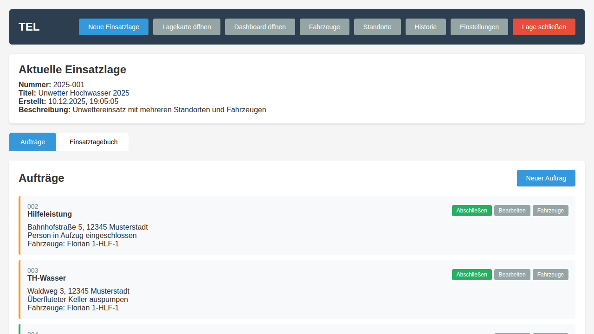
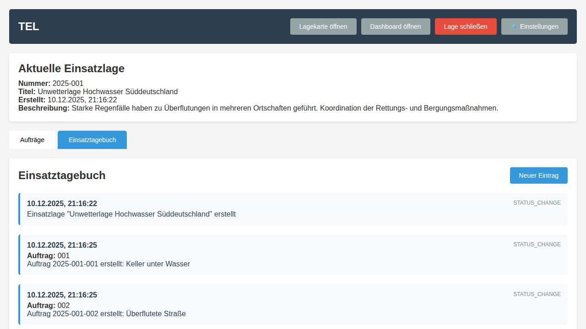
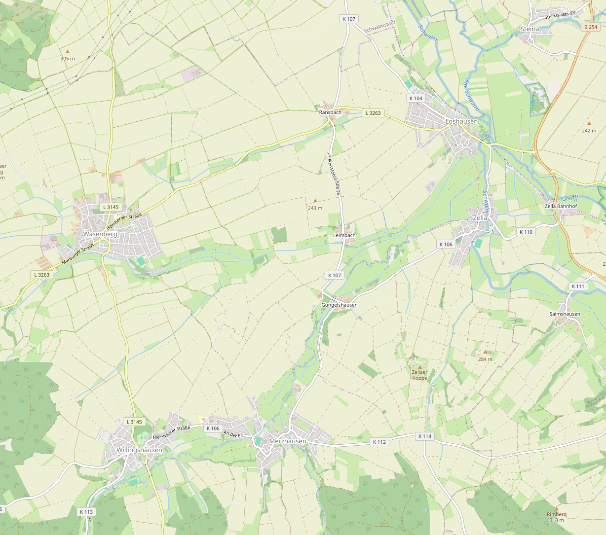
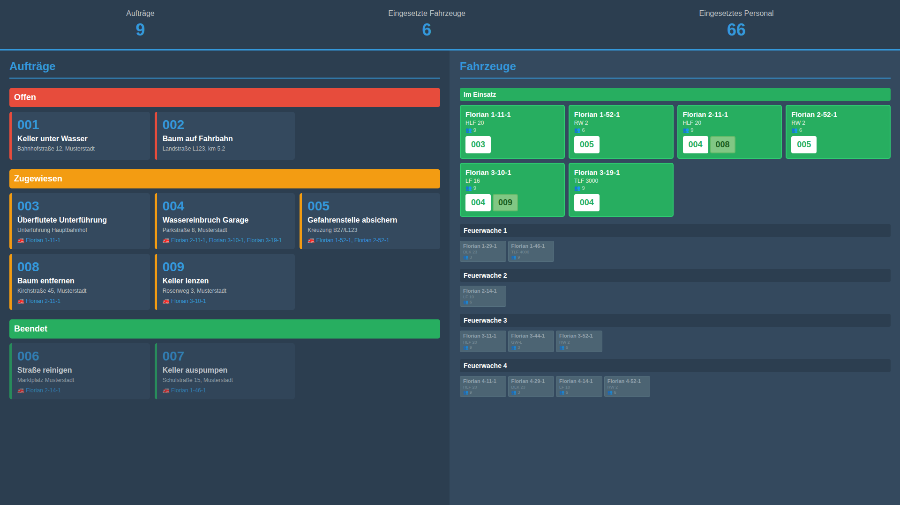
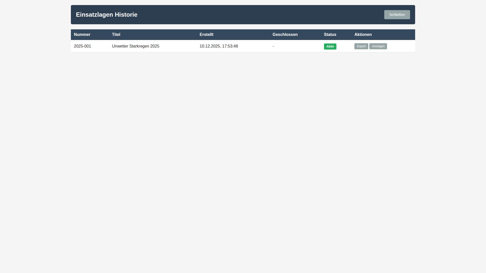

# User-Guide (TEL-System)

## Zweck
Dieser Guide beschreibt die tägliche Bedienung des TEL-Systems für Disposition und Einsatzleitung.

## Einstieg
1. Anwendung im Browser öffnen (`http://localhost:5000` oder produktive URL).
2. Falls noch keine aktive Lage besteht: **Neue Einsatzlage** klicken.
3. Titel und optional Beschreibung eintragen, dann **Erstellen**.

## Standard-Arbeitsablauf

### 1) Auftrag erfassen
1. Auf **Neuer Auftrag** klicken.
2. Einsatzstichwort, Status, Einsatzort und Beschreibung erfassen.
3. Optional Koordinaten/PDF ergänzen.
4. Auftrag speichern.

### 2) Fahrzeuge und Ressourcen überwachen
- Auf der Hauptseite werden Fahrzeuge nach Verfügbarkeit angezeigt.
- Über **⚙️ Einstellungen** können Stammdaten (Fahrzeuge/Standorte) geöffnet werden.

### 3) Einsatztagebuch führen
1. Tab **Einsatztagebuch** öffnen.
2. **Neuer Eintrag** wählen.
3. Typ, optional Auftrag und Inhalt speichern.

### 4) Lagekarte nutzen
- **Lagekarte öffnen** zeigt Einsatzstellen und Fahrzeuge auf der Karte.
- Linke/rechte Seitenleisten zeigen eingesetzte und verfügbare Fahrzeuge.

### 5) Dashboard für Lageübersicht
- **Dashboard öffnen** zeigt die beameroptimierte Gesamtsicht.
- Ideal für Führungsraum/Leinwandbetrieb.

### 6) Lage abschließen und Historie prüfen
1. Nach Einsatzende **Lage schließen** wählen.
2. Über **⚙️ Einstellungen → Historie** vergangene Lagen prüfen.

## Kurzreferenz
- **Aufträge**: erfassen, bearbeiten, Status ändern, abschließen
- **Einsatztagebuch**: laufende Dokumentation aller Ereignisse
- **Lagekarte**: räumliche Übersicht
- **Dashboard**: komprimierte Führungsansicht
